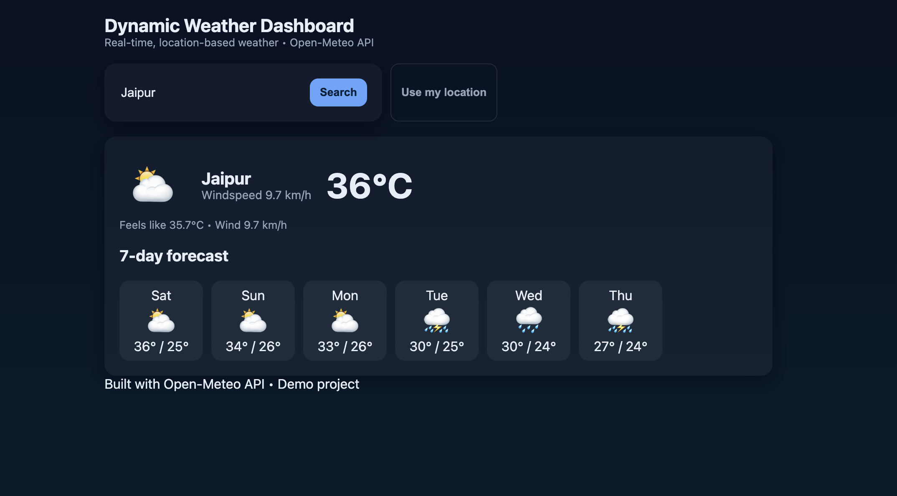

# 🌦️ Dynamic Weather Dashboard

A simple, responsive web app that shows **real-time weather** and a **5-day forecast**.  
Powered by the [Open-Meteo API](https://open-meteo.com/) — no API key required.

## 🚀 Features
- Search weather by **city name**
- Get weather using **your current location**
- Displays:
  - Current temperature, wind speed, condition
  - 5-day forecast with min/max temperatures
  - Weather icons
- Mobile-friendly, dark-themed UI

## 📱 Preview


## 🛠️ Tech Stack
- HTML5  
- CSS3 (custom dark theme)  
- Vanilla JavaScript (Fetch API, Geolocation API)  
- [Open-Meteo](https://open-meteo.com/) for free weather data  

## 📂 Project Structure
weather-dashboard/.   
├── index.html         
├── style.css         
├── app.js             
├── README.md           
├── preview.png        
├── .gitignore            
└── LICENSE


## ⚡ How to Run
1. Clone this repo:
   ```bash
   git clone https://github.com/Anuja-lang/Dynamic_Weather_Dashboard.git
   cd weather-dashboard
2. Open index.html in your browser.


    (No build step required — pure HTML, CSS, JS)
